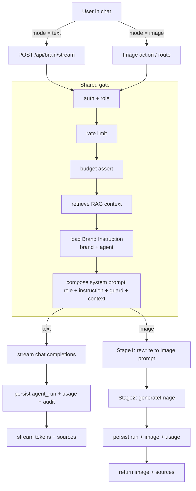

# Brand Brain & Agents — Architecture / System Design

> Status: **Phase A (dynamic brand instruction) implemented.** Phases B–D
> pending.
> Decisions locked: per-brand **and** per-agent instructions · explicit
> Text/Image mode switch · admin-only editing · empty default + starter
> template · 8000-char single live field · images persisted in-thread.

---

## 1. Vision — the "GPTs for a brand" model

Each brand should feel like a private GPT:

- A brand-level **Instruction** (system prompt) written/edited in the admin panel.
- A set of **Knowledge** files uploaded once, embedded once, and retrieved on
  demand (RAG) — never re-scanned per message.
- One chat surface that can answer in **text** or, when switched to **image
  mode**, produce on-brand visuals.
- Optional **per-agent** overrides so a single brand can host several "GPTs"
  (Brain, Image Generator, Story Teller, …) that share the brand voice but each
  have their own role.

The platform already has most of the plumbing; the gap is **dynamic, admin-edited
instructions** and an **in-chat image mode**.

---

## 2. Current state (as built)

| Concern | Today |
| --- | --- |
| RAG | Self-hosted **pgvector**. Files chunked + embedded once at sync time; per query we embed the question and run `match_knowledge_chunks` (ANN). |
| Brain chat | Multi-turn, **streaming** (`POST /api/brain/stream`, NDJSON), with conversation rehydrated from `agent_runs`. Rate-limit + budget + audit enforced. |
| System prompt | **Hardcoded.** `brain/llm.ts` → `BRAIN_SYSTEM_PROMPT`; `runs/prompts.ts` → `agentSystemPrompts` (per-agent, **not per-brand**). |
| Image generation | Exists. `IMAGE_GENERATOR` agent + `rewritePromptForImage` (stage 1) + `generateImage` (stage 2, two OpenRouter transports). |
| Agent catalog | Seeded: `BRAND_INTEGRATOR_BRAIN`, `STORY_TELLER`, `IMAGE_GENERATOR`, `VIDEO_GENERATOR`, `CAMPAIGN_MAKER`, `BRAND_DIGITAL_ACTIVATION`. |
| Persistence | `agent_runs` stores every run (input/output/sources/usage). No new table needed for chat history. |
| Security | RLS **deny-by-default + force** on every table; all server access via service-role admin client. |

**Clarification on "RAG once vs file search":** correct mental model. Files are
embedded **once**. Per message we do a cheap **vector retrieval** (one query
embedding + an index lookup) — this is the core of RAG and stays. We do **not**
use provider-side `file_search`. The leftover `extractBrandBrainSources`
(provider `file_search_call` parser) in `brain/schema.ts` is dead and should be
removed.

---

## 3. Target architecture

### 3.1 Layered system-prompt composition

The single most important design rule: the brand-editable text is **one layer**,
sandwiched between code-locked layers so an admin can shape persona/voice but
**cannot** weaken safety or cross-brand isolation.

```
finalSystemPrompt =
    [1] Role prompt            — in code, per-agent     ("You are the Brand Integrator Brain…")
  + [2] Brand Instruction      — in DB, per-brand (+ per-agent override)   ★ NEW, admin-edited
  + [3] Safety / Scope guard   — in code, non-overridable  (only this brand's knowledge; cite sources; no leakage)
  + [4] RAG context            — retrieved chunks for this question
```

Resolution of layer [2] for a given `(brand, agent)`:

```
effectiveInstruction(brand, agent) =
    perAgentRow(brand, agent).instruction      if present and enabled
    else brandWideRow(brand, agent=NULL).instruction   if present and enabled
    else ""                                    (falls back to role + guard only)
```

### 3.2 Data model (proposed migration — NOT applied)

`0024_brand_agent_settings.sql`:

```sql
create table public.brand_agent_settings (
  id          uuid primary key default gen_random_uuid(),
  brand_id    uuid not null references public.brands(id)  on delete cascade,
  agent_id    uuid references public.agents(id) on delete cascade,  -- NULL = brand-wide default
  instruction text,
  is_enabled  boolean not null default true,                        -- enable/disable this agent for this brand
  updated_by  uuid references public.users_profile(id),
  updated_at  timestamptz not null default now(),
  created_at  timestamptz not null default now()
);

-- One row per (brand, agent); one brand-wide row (agent_id NULL) treated as a
-- distinct slot via a sentinel in the unique index.
create unique index ux_brand_agent_settings_brand_agent
  on public.brand_agent_settings (
    brand_id,
    coalesce(agent_id, '00000000-0000-0000-0000-000000000000'::uuid)
  );

create index idx_brand_agent_settings_brand on public.brand_agent_settings(brand_id);

-- Follow the repo's deny-by-default pattern: enable + force RLS, no policies,
-- access only through the service-role admin client.
alter table public.brand_agent_settings enable row level security;
alter table public.brand_agent_settings force row level security;
```

Why a dedicated table (not a column on `brands`):
- Supports **brand-wide default + per-agent override** in one place (the locked
  decision).
- Carries `is_enabled`, `updated_by`, `updated_at` for admin UX and audit.
- Leaves room to add versioning / draft-publish later without touching `brands`.

### 3.3 RAG pipeline (unchanged, documented)

```
Upload ──► chunk ──► embed (once) ──► pgvector (knowledge_chunks)
                                          │
Question ─► embed query ─► match_knowledge_chunks (top-K, brand-scoped) ─► context
```

- Retrieval is always **brand-scoped** (`match_brand_id`) — this is the hard
  isolation boundary, independent of the prompt text.
- Optional `moduleIds` filter already supported for agent-scoped knowledge.

### 3.4 Image / video generation — explicit mode switch

Decision: the chat has an explicit **Text / Image** mode toggle (no implicit
tool-calling for now; upgradeable later).

```
TEXT mode:
  question ─► retrieve ─► compose(system) ─► chat.completions (stream) ─► text + sources

IMAGE mode (two stages):
  Stage 1 (LLM, prompt engineering):
    question + Brand Instruction(IMAGE_GENERATOR) + RAG context
      ─► rewritePromptForImage ─► tight on-brand image prompt
  Stage 2 (image model):
    image prompt ─► generateImage ─► PNG(s) ─► persist + signed URL
```

Key facts that drive the design:
- Image models on OpenRouter take **only a prompt string** — no chat system
  prompt. So the brand identity must be **baked into the prompt by Stage 1**,
  which is exactly where the brand Instruction + RAG apply.
- Video today is **strategy/storyboard only** (no asset generation); same
  Stage-1 composition, no Stage 2. Real video asset generation is a separate,
  later phase.

### 3.5 Request flow (Brain chat, both modes)



---

## 4. Module / file map (where things will live)

| Piece | Location |
| --- | --- |
| Migration | `supabase/migrations/0024_brand_agent_settings.sql` |
| Instruction read/write (server) | `features/agents/brain/instructions.ts` (or shared `features/agents/instructions/`) |
| Prompt composition | extend `brain/llm.ts` `buildBrandBrainMessages` to accept `instruction`; same idea for `runs/llm.ts` |
| Stream prepare | `prepareBrandBrainStream` loads instruction and injects into layer [2] |
| Admin UI | `app/(admin)/admin/.../[brandId]/agents` — per-brand list of agents with editable Instruction + enable toggle |
| Chat mode switch | `features/agents/brain/components/BrainChat.tsx` — Text/Image segmented control; image turns hit the image pipeline |
| Image pipeline | reuse `features/agents/runs` (`rewritePromptForImage`, `generateImage`, `uploadAgentImagePng`) |

---

## 5. Security & guardrails (must-hold invariants)

1. **Brand isolation is enforced at retrieval**, not via the prompt — every
   vector search is filtered by `brand_id`. An edited Instruction can never
   reach another brand's knowledge.
2. **Safety layer [3] is code-locked** and appended *after* the brand
   Instruction, so admin text cannot override "use only this brand's knowledge"
   or "do not leak system details."
3. **Prompt-injection posture:** retrieved chunks and the brand Instruction are
   treated as data; the role + guard frame them. Keep RAG context clearly
   delimited (already done with `--- Source: … ---`).
4. **RLS deny-by-default + force** on the new table; only the service-role admin
   client reads/writes it.
5. **Budget + rate-limit + audit** apply identically to text and image runs
   (shared gate). Image runs meter `IMAGE` usage.
6. **Who can edit Instructions:** **platform admins only** (v1) — enforced in
   the admin route, audited via `updated_by` + `audit_logs`. Instruction capped
   at **8,000 chars**.

---

## 6. Phased roadmap

- **Phase A — Dynamic Brand Instruction** ✅ implemented
  - migration `0024_brand_agent_settings` · `getBrandAgentInstruction` read in
    `prepareBrandBrainStream` + `runBrandBrain` · layered composition
    (`BRAIN_ROLE_PROMPT` + instruction + `BRAIN_SAFETY_GUARD` + context via
    `joinPromptLayers`) · admin UI at `/admin/agent-instructions` (brand picker,
    brand-wide default + per-agent slots, 8000-char cap, Starter Template,
    enable toggle) · audit action `brand_instruction_updated` · brand-wide
    default left empty (zero behavior change until an admin writes one).
- **Phase B — Unify prompts**
  - move `runs/prompts.ts` agents onto the same layered composition; retire
    hardcoded brand text; delete dead `file_search` parser.
- **Phase C — In-chat Image mode**
  - Text/Image switch in `BrainChat`; wire image turns to the two-stage
    pipeline; render + persist images in the thread.
- **Phase D — Video**
  - storyboard/brief now; real asset generation later (separate provider work).

---

## 7. Resolved decisions (settled before Phase A)

1. **Edit rights — platform admin only.** Brand owners do **not** edit
   Instructions in v1. Enforced in the admin route; every write audited via
   `updated_by` + `audit_logs`.
2. **Brand-wide default seed — leave empty.** The current `BRAIN_SYSTEM_PROMPT`
   is Role + Safety, which now live in code layers [1]/[3]; seeding it into the
   editable layer [2] would duplicate and blur those. Default empty ⇒ **zero
   behavior change** for existing brands (role + guard only). The admin UI
   ships a **Starter Template** ("Insert template" button) focused purely on
   brand voice / persona / do's & don'ts — never role or safety.
3. **Length & lifecycle — 8,000-char cap, single live field, no draft/publish
   in v1.** ~2k tokens is enough for a full brand-voice doc without diluting
   context or inflating cost. Save = live; traceability/rollback come from
   `updated_by` + `updated_at` + `audit_logs`. The table is shaped so a future
   `status` / `published_instruction` column is a **non-breaking** add if an
   approval workflow is ever needed.
4. **Image persistence — yes, in the same thread.** Generated images are stored
   as `agent_runs` (output references the stored PNG path / signed URL) so the
   conversation rehydration surfaces image turns inline alongside text turns,
   surviving reloads (extends `getBrandBrainConversation` to map image runs to
   an assistant message carrying an image attachment).

## 8. Future considerations (explicitly deferred)

- Draft → review → publish workflow for Instructions (if approvals are needed).
- Implicit tool-calling image generation (auto-detect intent) as an upgrade over
  the explicit Text/Image switch.
- Real video **asset** generation (separate provider integration).
- Per-brand owner self-service editing, once admin-only is proven.
